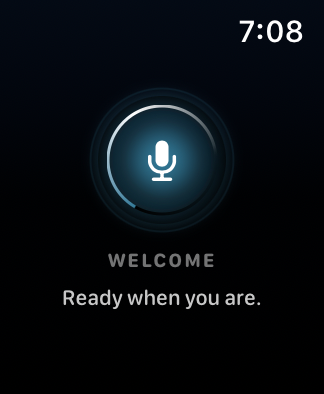

# Watchamacallit

A voice-first watchOS app powered by OpenAI's `gpt-realtime-2.1` model.

Tap the center button once to start an open-microphone Realtime session. Speak
naturally; server-side voice activity detection decides when each turn ends and
the assistant answers with audio. Tap again to stop.

## Requirements

- Xcode 16 or newer with the watchOS SDK
- [XcodeGen](https://github.com/yonaskolb/XcodeGen) (`brew install xcodegen`)
- Apple Watch or watchOS Simulator running watchOS 11+
- An OpenAI API project with access to `gpt-realtime-2.1`

## Run

1. Run `make generate` (or `make open` to generate and open the project).
   That copies `Watchamacallit/AppSecrets.swift.template` to
   `Watchamacallit/AppSecrets.swift` if the secrets file is missing.
2. In `Watchamacallit/AppSecrets.swift`, replace `sk-your-open-ai-key` with your API
   key. That file is gitignored; keep using the template for new checkouts.
3. In `project.yml`, set `DEVELOPMENT_TEAM` to your 10-character Apple Developer
   Team ID (Account → Membership details on [developer.apple.com](https://developer.apple.com/account)).
   Change `PRODUCT_BUNDLE_IDENTIFIER` if you are not using the published ID.
   Run `make generate` again so XcodeGen picks up the signing settings.
4. Select the **Watchamacallit** scheme and a watchOS destination.
5. Build and run.
6. Accept microphone permission, then tap the center control.

Run `make build` for an unsigned generic watchOS build from the command line.

## Behavior

- One tap starts the microphone and connects to OpenAI.
- Semantic voice activity detection creates responses automatically.
- Audio plays as it streams back from the model.
- Speaking while the assistant is responding does not interrupt its response.
- A second tap closes the connection and releases the microphone.

## License

This project is licensed under the [MIT License](LICENSE).

If you use it in an app, demo, talk, or write-up, a shout-out would mean a lot — tag me on X, [@khooeee](https://x.com/khooeee).
